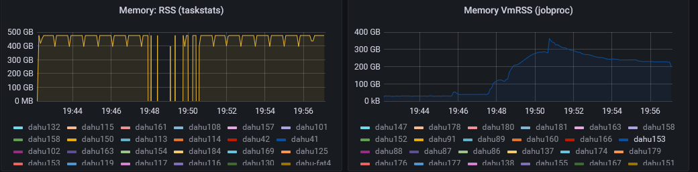

## Connect to Gricad clusters

More details about Griccad infrastructure are available here:

**https://gricad-doc.univ-grenoble-alpes.fr/hpc/**

**Get your account on Gricad**

If you have an **agalan** login/password

https://perseus.univ-grenoble-alpes.fr/create-account/portal-agalan

if not, create an external account with the email from your institution (private email @gmail/@yahoo are not allowed)

https://perseus.univ-grenoble-alpes.fr/create-account/form

Once you created your account, you should receive an email from perseus that asks you to validate your account with a **KEY** provided in the email

Connect again to perseus and enter the provided **KEY** et it should be ok.

It should take 1 day to get your account activated. If you nee a rapid accesss, feel free to contact **mondher.chekki@XXXXX**

  ```mermaid
graph TD;
A[f-dahu] --> B(dahu33);
A --> C(........);
A --> D(dahu192);
A --> E(dahu-fat1);
A --> F(............);
A --> G(dahu-fat4);
A --> H(dahu-visu);
```
  
**Create an ssh key**
```  
ssh-keygen -t rsa
```  
 
Type **Enter** twice WITHOUT ENTERING ANY PASSWORD and you should have two keys in **$HOME/.ssh**  
  
a private key: id_rsa  
a public key : id_rsa.pub  

**Create config file**


Then create the **$HOME/.ssh/config** file on your computer , in which you must enter the bastion and server information for the connection.

replace login_gricad with yours 
  
For Dahu server:  
  
  ```
Host dahu  
ProxyCommand ssh -qX login_gricad@trinity.u-ga.fr nc 129.88.197.54 22  
User login_gricad  
GatewayPorts yes
``` 
  
  
Next, you need to set the correct rights:  
  
**chmod ugo-rwx .ssh/config**  
**chmod u+rw .ssh/config**  
  
keep read/write rights only for the user and the private key: id_rsa  
  
Then, copy the ssh keys  
 ```
ssh-copy-id login_gricad@trinity.u-ga.fr 
  ```
 
Enter the agalan passwod  

then  
 ```
ssh-copy-id dahu
```
  
Enter the agalan password  
  
and you should be good for future sessions.  
  
Now, to connect, just type  
 ``` 
ssh dahu
```
## Running jobs on Gricad clusters

Once you are connected to dahu, you will be able to run jobs with the scheduler named OAR 

An introduction to OAR is described here  

https://gricad-doc.univ-grenoble-alpes.fr/hpc/joblaunch/job_management

Basically, to perform computations, you don't have to do them on the server you're connected to (front-end), but on other servers (compute nodes) accessible from the front-end.
  
Hence you need to use a job scheduler (OAR) to launch calculations on the nodes.  

For example, let's say that you need to run R calculations on the server

To install R packages

Either use **nix/guix** environement  

**Nix:**
https://gricad-doc.univ-grenoble-alpes.fr/hpc/softenv/nix/#r-packages

**Guix:**
https://gricad-doc.univ-grenoble-alpes.fr/hpc/softenv/guix/

Or **conda/micromamba** : **micromamba** is faster

```
# Download micromamba
curl –L micro.mamba.pm/install.sh >install.sh
# Installation de micromamba
bash install.sh 
source ~/.bashrc
# Create an environement with python=3.10
micromamba create -n Renv python=3.10 -c conda-forge
# Activate the environement
micromamba activate Renv
# Install  R+package netcdf
micromamba install r –c conda-forge
micromamba install r-essentials –c conda-forge
micromamba install r-ncdf4 –c conda-forge

```
Here's an example of a job header:
Change the name of project to your project  
```
$ cat job_exemple.oar
  
#!/bin/bash  
#OAR -n Test_job  
#OAR -O Test_job.%jobid%.o  
#OAR -E Test_job.%jobid%.e  
#OAR --project sno-elmerice
#OAR -l nodes=1/core=1,walltime=01:30:00  
  
cd YOUR_WORKING_DIRECTORY
micromamba activate Renv

R CMD BATCH ....
or
Rscript ....

```
  
**Description:**  
```
#OAR -l nodes=1/core=1,walltime=01:30:00
```  
Launch of a job, on a single computing core for 1h30 (possibility of increasing core=1 a plus when using MPI)  
The project on which the hours will be used is sno-elmerice

The results will be written to two files  
```
#OAR -O Test_job.NUMERO_JOB.o (standart output)  
#OAR -E Test_job.NUMERO_JOB.o (standart error)
```
If you want to use the fat nodes, just add this to your script:
```
#OAR -t fat
```
If you need to use immediatly the node  without waiting add this  (yo need to asked for a walltime less than 30 minutes
```
#OAR -t devel
```
**Memory**
You have different type of nodes with different features (use recap.py  to see all of them). The memory you are using in a job is equal to:
```
n_cores_asked x ( total_mem/n_cores)
```
If  you want the whole memory, you should asked for all available cores (n_cores)
```
[f-dahu /home/chekkim ]$ recap.py  
========================================================================================  
| node | cpumodel |n_cpus n_cores| scratch1_type | hasgpu |  
| | | total_mem| scratch2_type | |  
========================================================================================  
| dahu33 | Gold 6130 | 2 | 16 | 192 |dedicated_ssd | dedicated_hdd | NO |  
| dahu34 | Gold 6130 | 2 | 32 | 192 |dedicated_ssd | dedicated_hdd | NO |  
| [ + 37 more node(s) ] |  
| dahu72 | Gold 6130 | 2 | 32 | 192 |dedicated_ssd | dedicated_hdd | NO |  
| dahu73 | Gold 6126 | 2 | 24 | 192 |system_ssd | dedicated_hdd | NO |  
| [ + 2 more node(s) ] |  
| dahu76 | Gold 6126 | 2 | 24 | 192 |system_ssd | dedicated_hdd | NO |  
| dahu77 | Gold 6126 | 2 | 24 | 192 |dedicated_ssd | dedicated_hdd | NO |  
| [ + 3 more node(s) ] |  
| dahu81 | Gold 6126 | 2 | 24 | 192 |dedicated_ssd | dedicated_hdd | NO |  
| dahu82 | Gold 6130 | 2 | 32 | 192 |dedicated_ssd | dedicated_hdd | NO |  
| [ + 23 more node(s) ] |  
| dahu106 | Gold 6130 | 2 | 32 | 192 |dedicated_ssd | dedicated_hdd | NO |  
| dahu107 | Gold 6130 | 2 | 32 | 192 |dedicated_ssd | none | NO |  
| dahu108 | Gold 5218 | 2 | 32 | 192 |dedicated_ssd | dedicated_hdd | NO |  
| dahu109 | Gold 5218 | 2 | 32 | 192 |dedicated_ssd | dedicated_hdd | NO |  
| dahu110 | Gold 6244 | 2 | 16 | 192 |dedicated_ssd | none | NO |  
| dahu111 | Gold 6244 | 2 | 16 | 192 |dedicated_ssd | none | NO |  
  
| dahu142 | Gold 5218 | 2 | 32 | 192 |dedicated_hdd | none | NO |  
| dahu143 | Gold 5218 | 2 | 32 | 192 |dedicated_hdd | none | NO |  
| dahu144 | Gold 5318Y| 2 | 48 | 256 |system_ssd | none | NO |  
| [ + 47 more node(s) ] |  
| dahu192 | Gold 5318Y| 2 | 48 | 256 |system_ssd | none | NO |  
| dahu-fat1| Gold 6244 | 2 | 16 |1500 |dedicated_raid0_ssd | dedicated_raid5_hdd| NO |  
| dahu-fat2| Gold 6244 | 2 | 16 |1500 |dedicated_ssd | dedicated_hdd | NO |  
| [ + 1 more node(s) ] |  
| dahu-fat4| Gold 6244 | 2 | 16 |1500 |dedicated_ssd | dedicated_hdd | NO |  
| dahu-visu| Silver 4216| 2 | 32 | 192 |system_hdd | none | NO |  
========================================================================================
```
To run the job in 
```
chmod 750 job_exemple.oar  
oarsub -S ./job_exemple.oar
```
**Use the interactive mode**

If you are developping a code, it is better to have acces to a node for debugging issues. In the passive mode , if you make a small mistake , then you  have to submit your job again and wait in the queue.
Using the interactive mode allows to correct your mistake and run your code until you make sure that everything is working fine.

To do that use **oarsub** with **-I** command:

```
oarsub -I -l nodes=1/core=1,walltime=01:30:00 --project sno-elmerice 
```
for devel mode
```
oarsub -I -l nodes=1/core=1,walltime=00:30:00 --project sno-elmerice -t devel
```
for fat nodes
```
oarsub -I -l nodes=1/core=1,walltime=04:30:00 --project sno-elmerice -t fat
```

**Job Stats with OAR**

Once your job is finished or in case it stops without any reasons, you can check the dashborad

>:warning: **Replace MYJOBID with your JOBID**

https://gricad-dashboards.univ-grenoble-alpes.fr/d/RUyeEaIGz/colmet-dahu-jobs-stats?orgId=1&refresh=1h&var-Job_ID=**MYJOBID**&var-Node=All&from=now-24h&to=now

Here is an example of Memory usage for different nodes




## Storage on Gricad clusters

**Workdir/Datastorage on dahu** 

 ```mermaid
graph TD;
A[dahu node] --> B(/bettik);
A --> C(/silenus);
A --> D(/mantis);
```

You have access to the $HOME(/home/your_login), which is a limited space under quota (50GB max).  

You must work on /bettik/login_gricad,  /bettik/PROJECTS/PROJECT_NAME/login_gricad or /bettik/PROJECTS/PROJECT_NAME/COMMON if you want to share you data/code between the members of the project 

Bettik is a parallel filesystem so it is very fast when it comes to write/read data by the same program with different tasks

This space is accessible to all nodes. 

More info on Gricad Website

https://gricad-doc.univ-grenoble-alpes.fr/hpc/data_management/bettik/
  
  
To copy data from your PC to /bettik, use the rsync command.  
  
Let's assume we have a folder: Data_Model  
  
We'd like to copy this folder to /bettik/login_gricad in order to use the data. 

  
The copy is made with the command rsync: 

  ```
rsync -rav Data_Model dahu:/bettik/login_gricad/  
  ```

To copy data from dahu to your PC:  

( be careful there's the dot . which means copy here)  
 ```
rsync -rav dahu:/bettik/login_gricad/Dossier_bettik .  
```

If you have a local folder called Local_folder to which you want to copy data from /bettik  

 ```
rsync -rav dahu:/bettik/login_gricad/Dossier_bettik/ Local_folder/
```

>:warning: if you want to transfer huge data or a lot of files use mantis-cargo instead 

https://gricad-doc.univ-grenoble-alpes.fr/hpc/data_management/data_transfer/

Replace dahu per mantis-cargo.u-ga.fr

```
rsync -rav Data_Model login_gricad@mantis-cargo.u-ga.fr:/bettik/login_gricad/
```

**Other Datastorage available  on dahu: /silenus and /mantis** 

Silenus is a parallel filesystem composed of SSD so it is very fast but consider this as a scratch as the files will be automatically deleted when they reach 60 days old.

https://gricad-doc.univ-grenoble-alpes.fr/hpc/data_management/silenus/

So If you need to save them, you have  to copy them to /bettik workdir for short term preservation(<1an), or to the Mantis2 cloud storage for long term preservation(<5ans).

>:warning:  if your files are only accessed in read mode, and you still use them, you
            should do a `touch <file>` or `touch -r <directory>` to update the change time as
            HPC scratches do not update the access time.
            Otherwise, they may be deleted 60 days after their creation.


Mantis is a cloud storage used for long term preservation

**First usage of mantis**

Copy this file to your $HOME/.irods directory on dahu, keep the same name  and put your login instead of chekkim

```
[f-dahu  /home/chekkim ]$  more .irods/irods_environment.json
{
        "irods_host": "mantis.u-ga.fr",
        "irods_port": 1247,
        "irods_user_name": "chekkim",
        "irods_zone_name": "mantis",
        "irods_authentication_scheme": "PAM",
        "irods_ssl_ca_certificate_file": "/etc/irods/chain.pem",
        "irods_ssl_verify_server": "cert"
}
```

and then connect using iinit

```
f-dahu  /home/chekkim ]$  iinit
Enter your current PAM password:
[f-dahu  /home/chekkim ]$  ils
/mantis/home/chekkim:
  bench_v1.tar
  elmerscalasca.tar
  netcdf-cxx4-4.3.1.tar.gz
  C- /mantis/home/chekkim/MARin
  C- /mantis/home/chekkim/input
  C- /mantis/home/chekkim/python
```

Enter your agalan password and you should be able to copy/get files to your mantis workspace using iget and iput commands

More details , here:

https://gricad-doc.univ-grenoble-alpes.fr/hpc/data_management/mantis/


**/home OR /bettik OR /silenus OR /mantis , how to choose**

**/home** you should put here all your scripts, code in python/bash/fortran/R and you should manage to save them (the /home is no longer saved) 
You should also think about using github or [Gricad gitlab](https://gricad-gitlab.univ-grenoble-alpes.fr/users/sign_in) to commit you changes and keep your codes up to date

**/bettik** should be used by default  for all your simulations as you have a large quota and your data is not cleaned.

**/silenus** should be tested with your workflow and see if the access to data is faster and  in this case re-organise you workflow to move your data older than 60 days from silenus

**/mantis**  is used in case you have **cold data** on /bettik that you are not going to use for a while ( let say < 6 months) but you need this data for future simulations


## Elmer usage on Gricad clusters

Once connect to dahu, first install the intel compilers

```
source /applis/site/nix_nur.sh
nix-env -i -A nur.repos.gricad.intel-oneapi
```
In case the previous command does not work, or generates erros , you can install intel compilers from my profile

```
nix-env -i --from-profile /nix/var/nix/profiles/per-user/chekkim/env_inteloneapi intel-oneapi
```

Once the intel compilers installed, in order to use them

```
source /applis/site/nix_nur.sh
source ~/.nix-profile/setvars.sh >/dev/null
```

In order to load Elmer modules , you have to put this on a config file **myconfig.sh** or in your **$HOME/.bashrc** and source it each time you need to use it
>:warning: If you put this in your .bashrc , it will be sourced automatically but may create conflict with other applications

```
source /applis/site/nix_nur.sh
source ~/.nix-profile/setvars.sh >/dev/null
 . /home/chekkim/LibGlace/versions/modules/modules_rev4401cc7d_gnu6.3.0/init/bash
export MODULEPATH=/home/chekkim/LibGlace/modulefiles
module load  netcdf/netcdf-4.7.2_intel21_hdf5_MPIO  xios/xios-2.0_rev2320_intel21    elmerfem/elmerfem-22c2e6b30_intel21
```

then

```
source $HOME/.bashrc
or
source  myconfig.sh
```

For the intel compilers you need to add this in your **$HOME/.bashrc** file in order to avoid seg fault errors when running jobs across nodes

```
ulimit -s unlimited
```

And it should be ok. In order to acces other versions of elmer you can check it with the command 

```
module avail elmerfem
```

In order to get rid of the old module, you need to modify your **$HOME/.bashrc** or your config file

In order to test it on a terminal:  this will not change the version you put on the **$HOME/.bashrc** or config file, but only affects the terminal you are using

```
module unload elmerfem
module load elmerfem/elmerfem-XXXXX
or
module switch old_module_name  new_module_name
```


