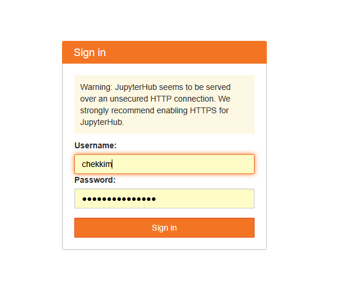
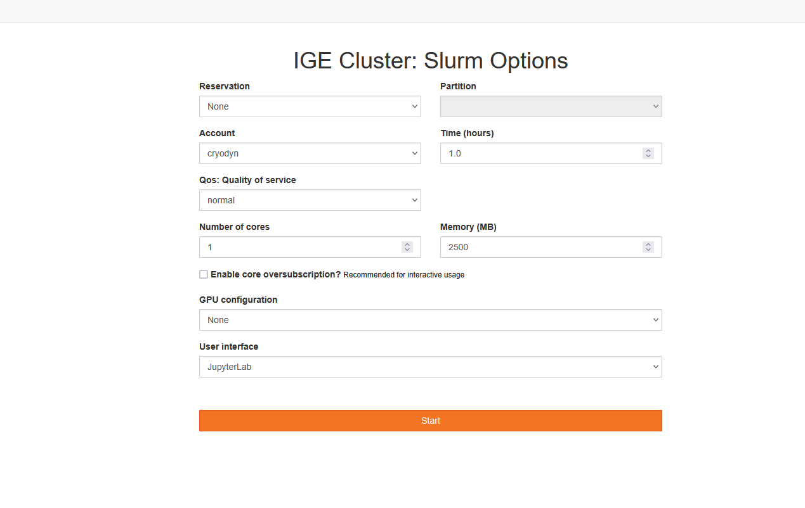
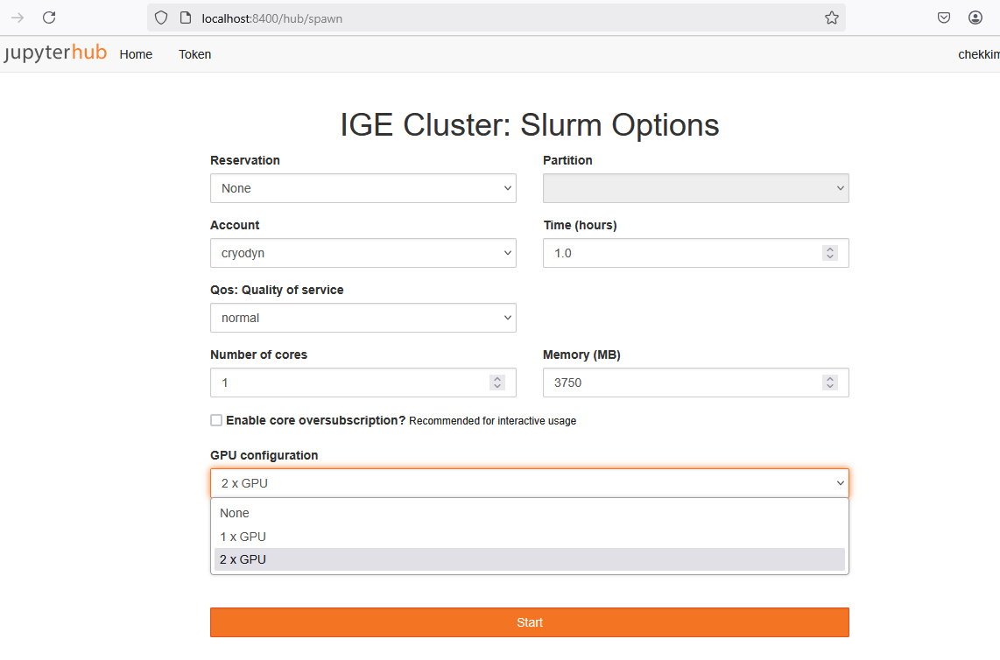
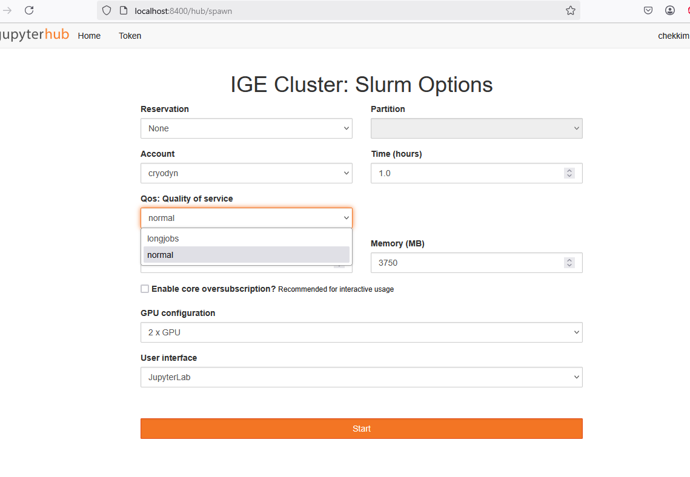
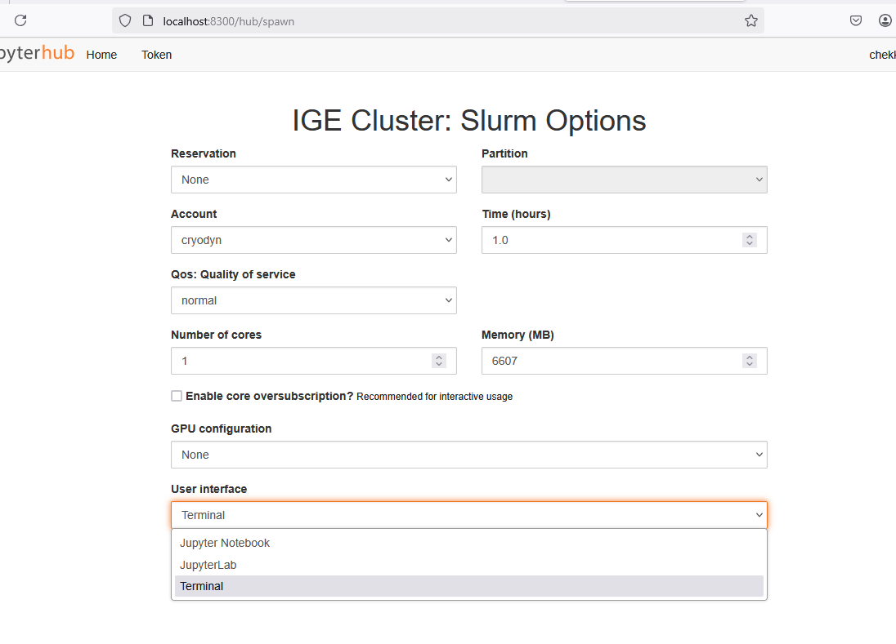
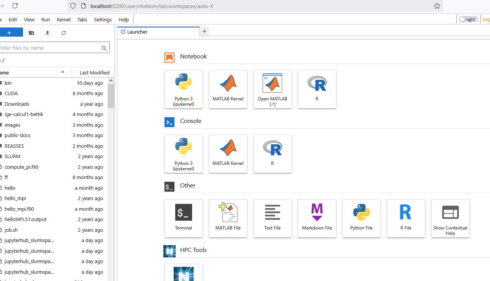
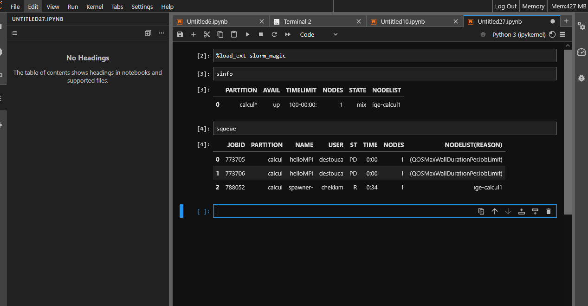
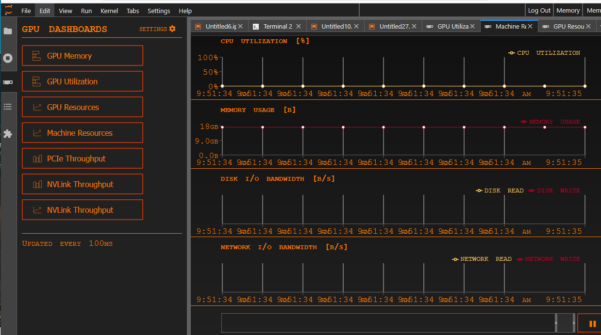
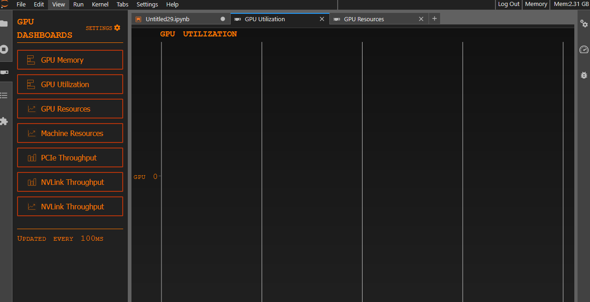
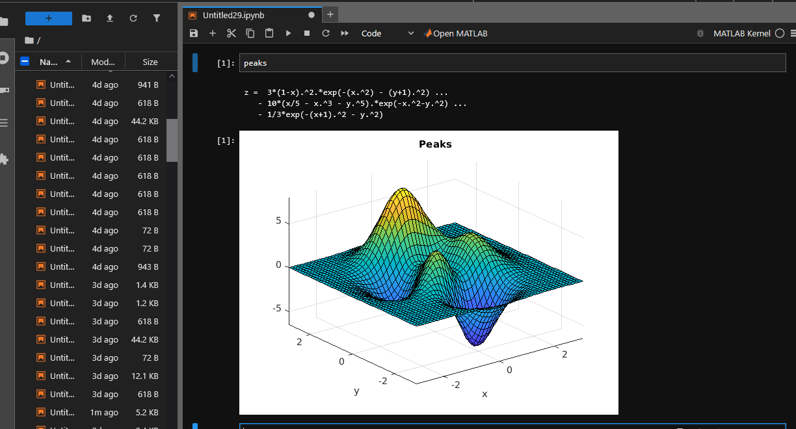

# Run a jupyter notebook on the cluster


Make sure you are able to connect to the clusters ige-calcul1/2//3/4 without any passwords
Please refers to the doc [Connect to the clusters](../Ige/ige-calcul1.md)

Il you are using the command 

```
ssh  calcul1
```

to connect to the cluster , then create the ssh tunnel using any port , here **8300**

```
ssh -fNL 8300:localhost:8000 calcul1
```

Once this done, open a local browser , with this url

```
http://localhost:8300
```

First, you will be asked for your agalan login/password



Then you get the different options to choose the needed ressources
1. Memory
2. CPUs/ GPUs
3. Time , etc...



Here is an example to choose the number of gpus if there are any



If you are allowed to run long jobs (more than 2 days), then the Qos longjobs will appear



You can choose, which interface you need, jupyterlab/jupyter or just a terminal



Finallay you are connected to the a job and have acces to different kernels (pre-built: Matlab +your own : R/...)




You can acces to slurm commands to check the status of your code, from a notebook



Check the cpu usage (extension on the left)



Check the gpu (extension on the left)



Use matlab

```{Note}
for the first usage you will be asked to give the license server 
27000@matlab.ige-grenoble.fr

```


