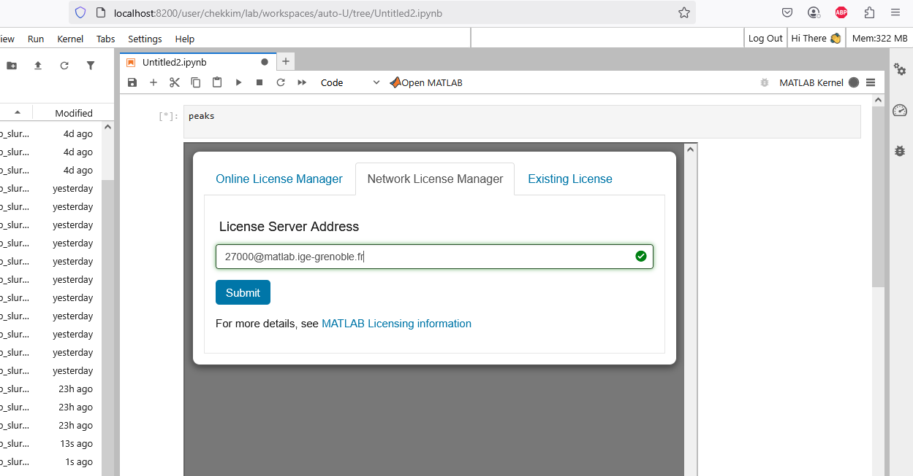
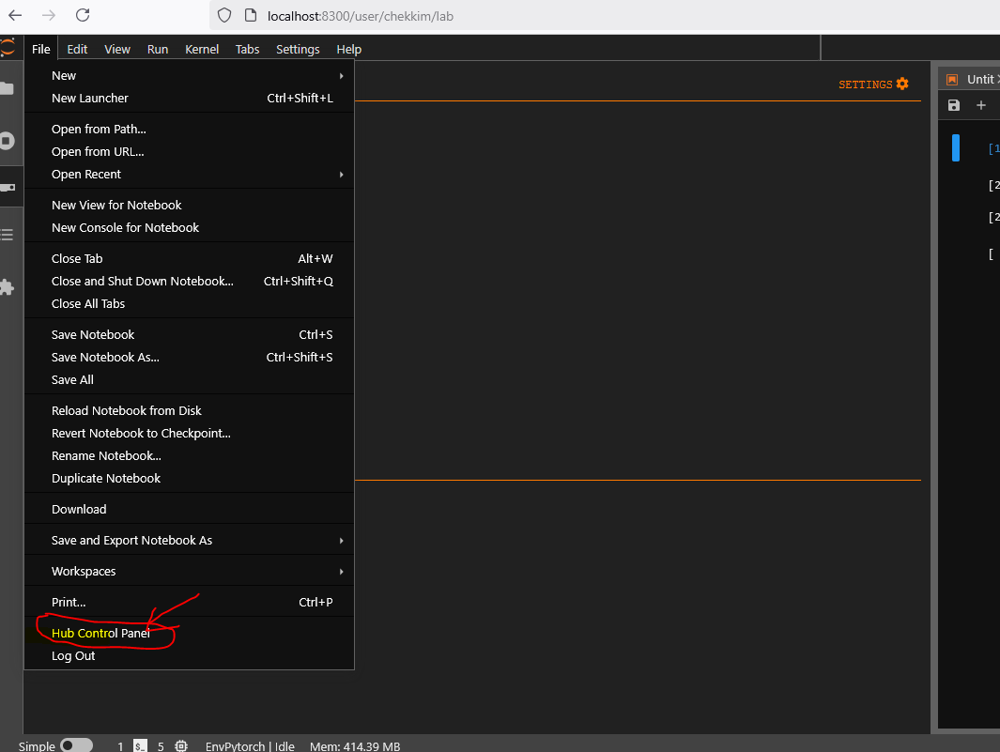
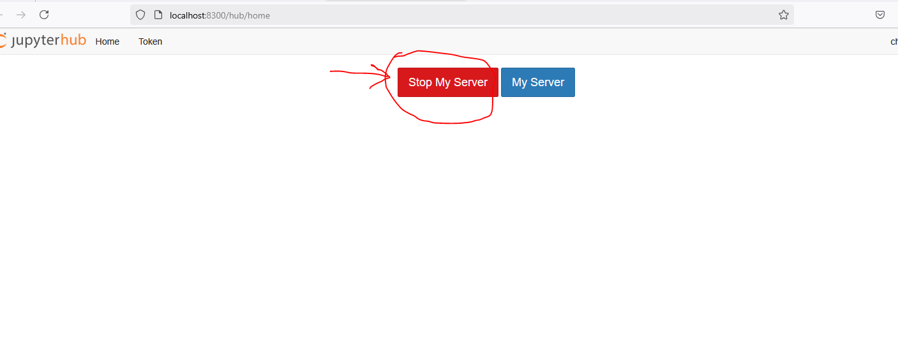
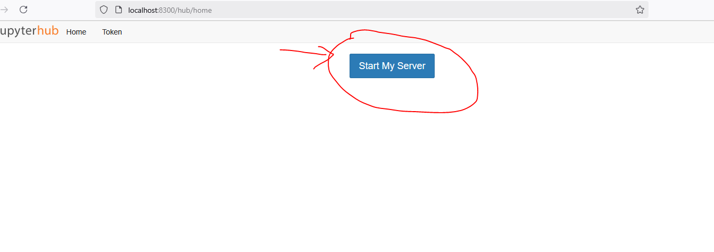
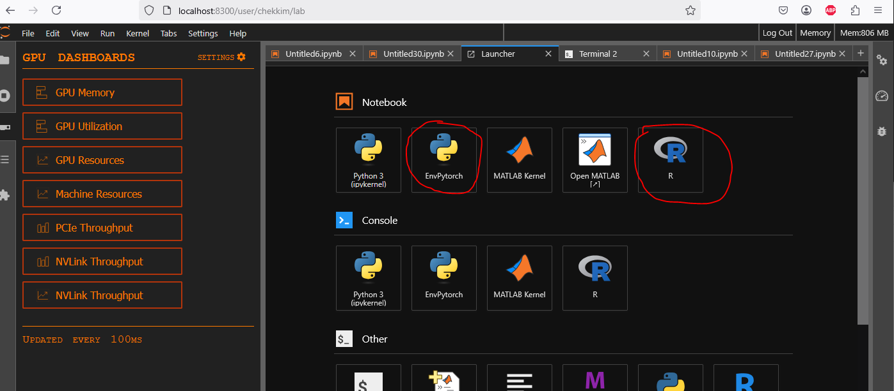
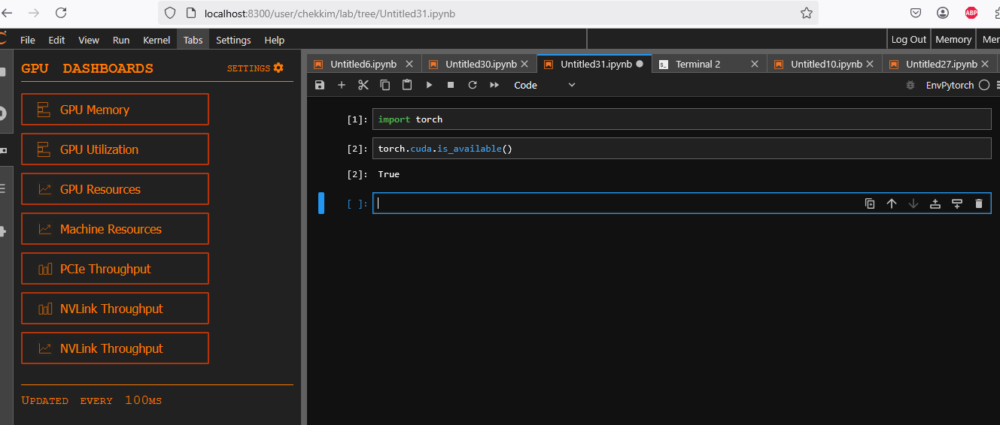
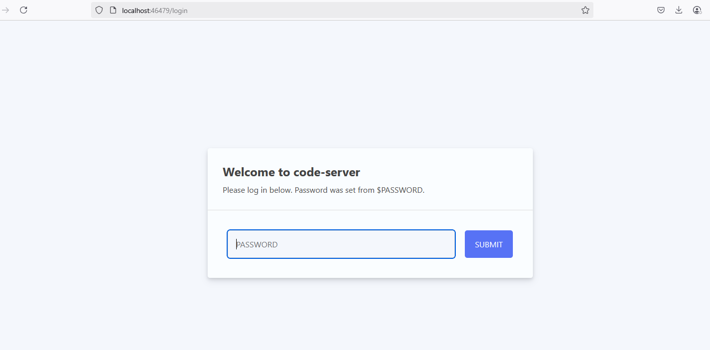
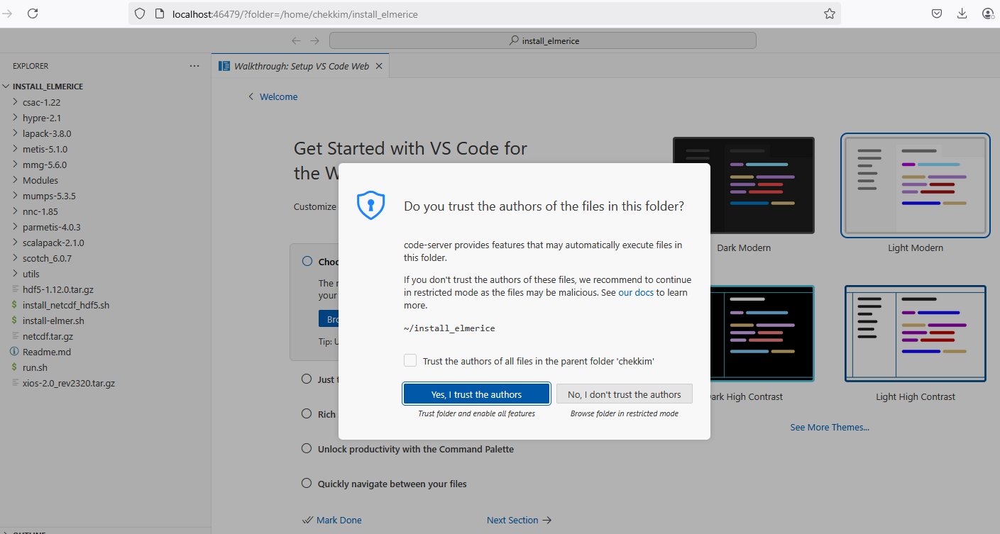
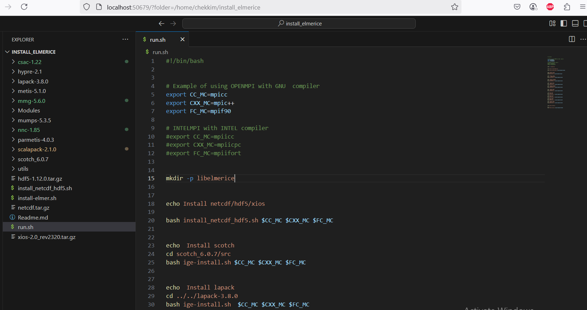

# Run a jupyter notebook on the clusters

Make sure you are able to connect to the clusters ige-calcul1/2//3/4 without any passwords
Please refers to the doc [Connect to the clusters](../Ige/ige-calcul1.md)


## Connect to the server

Il you are using the command 

```
ssh  calcul1
```

to connect to the cluster ige-calcul1 , then create the ssh tunnel using any port , here **8300**

```
ssh -fNL 8300:localhost:8000 calcul1
```

```{Note}
The jupyterhub is also available on the other clusters, i.e ige-calcul2 ige-calcul3 ige-calcul4
Make sure to have a look to the features of each cluster as you can access to large memory (up to 700G) and Gpus
```

Once this done, open a local browser , with this url

```
http://localhost:8300
```

First, you will be asked for your agalan login/password


Then you get the different options to choose the needed ressources
1. Memory
2. CPUs/ GPUs
3. Time , etc...


Here is an example to choose the number of gpus if there are any


If you are allowed to run long jobs (more than 2 days), then the Qos longjobs will appear


You can choose, which interface you need, jupyterlab/jupyter or just a terminal


Finallay you are connected to the a job and have acces to different kernels (pre-built: Matlab +your own : R/...)


You can acces to slurm commands to check the status of your code, from a notebook


Check the cpu usage (extension on the left)


Check the gpu usage (extension on the left)


Use matlab

```{Note}
For the first usage you will be asked to give the license server (Network License Manager)
27000@matlab.ige-grenoble.fr
```



Once it is done, you will be able to run matlab and the configuration will be saved for future usages


## Exit the server

In order to stop the kernel et kill the allocated job go to **Hub Control Panel**






## Restart the server

You can restart the server , by clicking on the button **Start My Server**
It will ask you again for new ressources adn connect you to the server



# Add you own environment



You can add you own kernel/ environment created with micromamba for example

## R exammple

1. Create your R environment
```
  micromamba create -n Renv python=3.10 -c conda-forge
  micromamba activate Renv
  micromamba install r r-base r-essentials -c conda-forge
```
2. Add the kernel to your jupyterlab

Open R terminal

```
 install.packages('IRkernel')
 IRkernel::installspec()
```
## Pytorch example

1. Create pytorch env
```
   micromamba create -n EnvPytorch python=3.10 -c conda-forge
   micromamba activate EnvPytorch
   micromamba install pytorch torchvision torchaudio  -c pytorch -c nvidia -c conda-forge
   micromamba install ipykernel  -c conda-forge
```
2. Install the pytorch environement

```
python -m ipykernel install --name EnvPytorch --prefix=/home/chekkim/.local
```



# Run Vscode on the clusters

```{Note}
If you don't need to use python and only vscode, you can select **Terminal** for the User Interface, instead of jupyterlab or jupyter
This will open only a terminal on the server
```
Once you are connected to jupyterhub 

Open a terminal from the jupyter launcher  and get the informations to connect to the server in the output of your job

```
head -10  $HOME/jupyterhub_slurmspawner_$SLURM_JOBID.log
```

Example for my JOBID=8:

```
chekkim@ige-calcul2:~$ head -10  jupyterhub_slurmspawner_8.log
********************************************************************
Starting code-server in Slurm
Environment information:
Date: mer. 12 févr. 2025 14:53:13 CET
Allocated node: ige-calcul2
Node IP:
Path: /home/chekkim
Password to access VSCode: user_jobid
Listening on: 46479
********************************************************************
```

Then create an ssh tunnel with the given port

```
ssh -fNL 46479:localhost:46479 calcul1/2/3/4
```

and open your local  browser 

```
http://localhost:46479
```

Entre the password:



Then you can open any folder on the remote server



and that's it , now you can modify your code and run vscode 


