# Winscp

## Download/upload files to the cluster

```{note}
Here we are using mantis-cargo to get data from Gricad cluster, but you can use it for any other clusters like ige-calcul{1,2,3,4}

**Make sure that you are able to connect to the clusters  without a password before going further**

Create a ssh key for:  [ mantis/dahu ](../../clusters/Gricad/dahu.md)  Or   
                       [ ige-calculX ](../../clusters/Ige/ige-calcul1.md)

```

The example of mantis is a direct connection. As for ige-calcu1 connection, it uses a ssh tunnel through ige-ssh proxy

You can download the last version from [ here ](https://winscp.net/eng/download.php) 

Then follow the next steps:

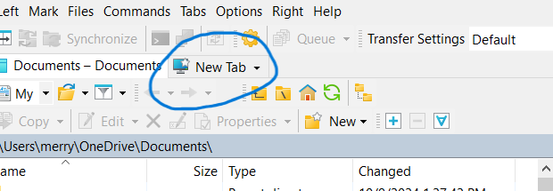


## Mantis Config


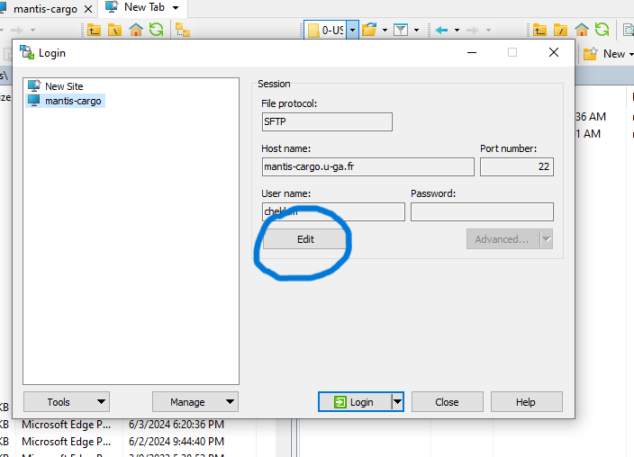

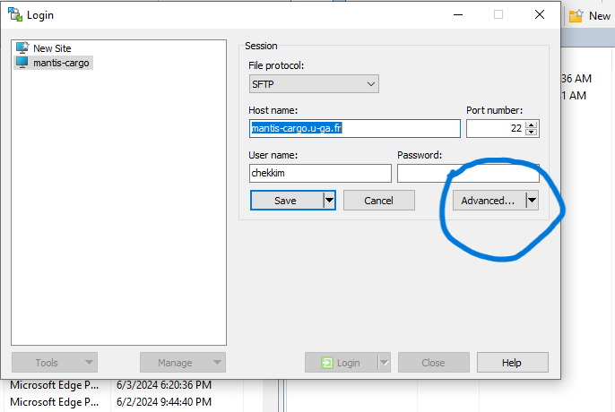


## Ige calcul1 Config


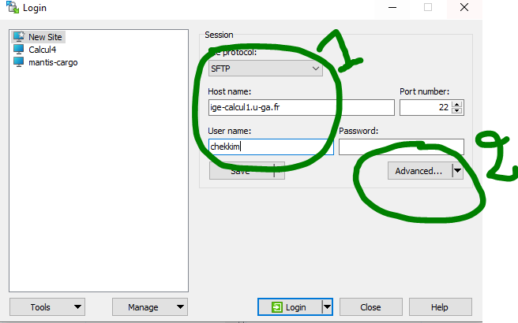
```{note}
In order to connect to ige-calcul1, you need to set-up a ssh tunnel ige-ssh

```
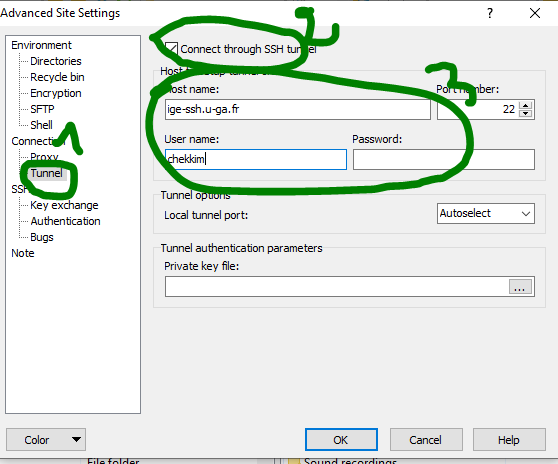

```{caution}
Make sure to change the username **chekkim** by your agalan login
```


## Load the ssh key 

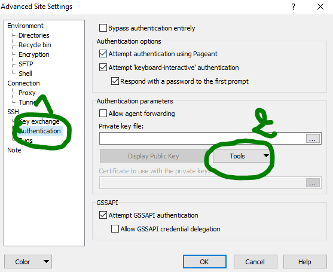

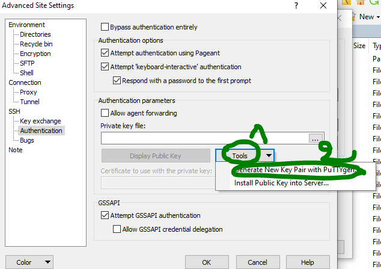

```{note}
At this step make sure you have already generated a key to connect to the cluster.

```

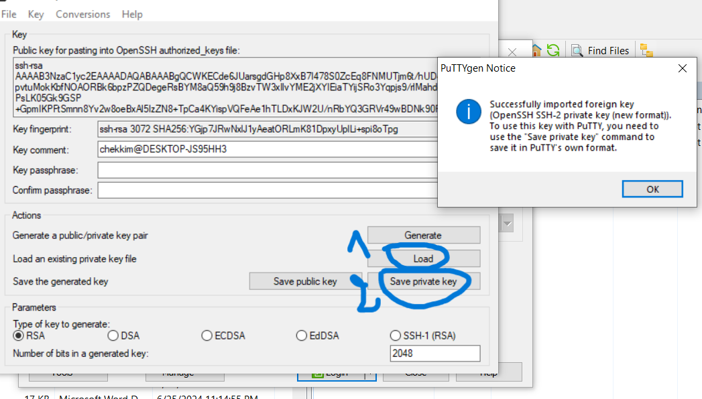

```{note}
This will load the ssh key and convert it in a ppk format 
```

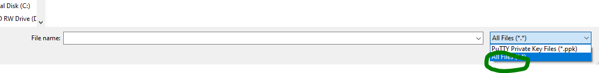

```{note}
Make sure to select **All files**  to be able to see the private ssh key to load
```

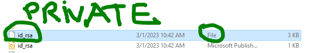

```{note}
Make sure to select the private key, on windows it says **FILE** as it is not recongnized
Once the key is loaded , you can convert it: click on **Save private key** and give it a new name
Example here: old name : id_rsa  and the new name is : id_rsa_winscp.ppk
```


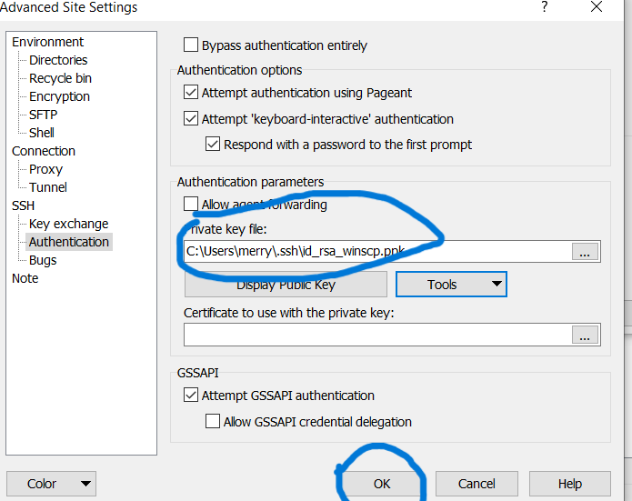

```{note}
For ige-cacul1, add the same key to the tunnel config
```
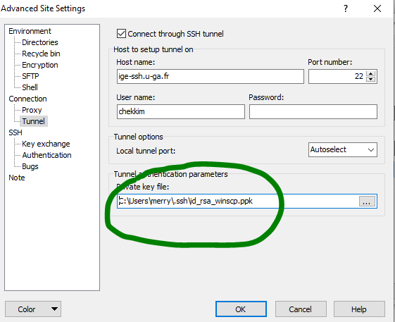

## Save and connect

Now you should save your configuration and give it a name otherwise everything will be lost

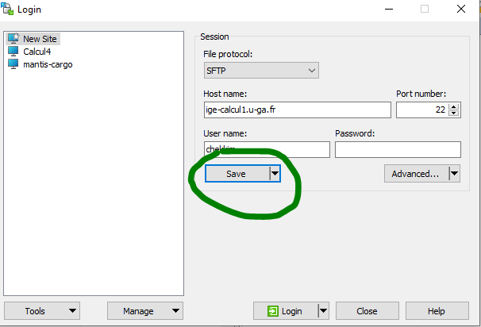

You can now connect and tranfer your files

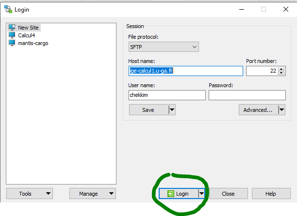

