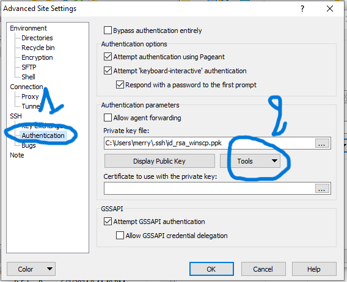
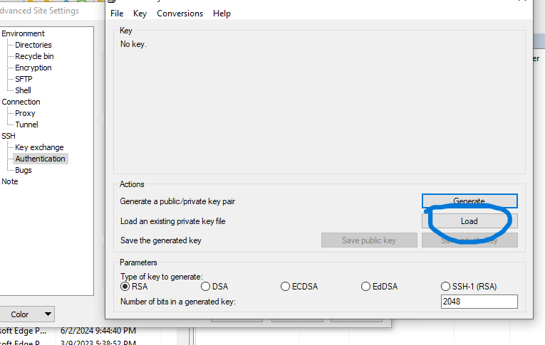

# Download/upload files to the cluster

```{note}
Here we are using mantis-cargo to get data from Gricad cluster, but you can use it for any other cluster
```

You can download the last version from   

Then follow the next steps:


```{note}
You can see the default ssh key detected, don't worry this key will be replaced by the new one
```


```{note}
At this step make sure you have already generated a key to connect to the cluster.

If not: Open a windows powershell  and type the command (do not give a password for the passphrase, just ENTER twice)

 ssh-keygen.exe -t rsa  

Load to winscp the private key:  **id_rsa** (and not id_rsa.pub) which is in the .ssh folder
```




```{note}
The ssh key will be saved in a ppk format used by winscp  to connect to the cluster
```


