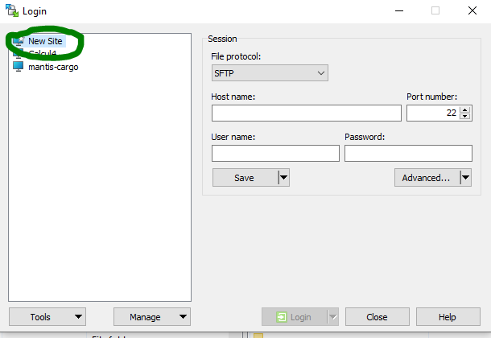

# Download/upload files to the cluster

```{note}
Here we are using mantis-cargo to get data from Gricad cluster, but you can use it for any other clusters like ige-calcul{1,2,3,4}
```

You can download the last version from   

Then follow the next steps:




## Mantis Config


## Ige calcul1 Config


```{note}
In order to connect to ige-calcul1, you need to set-up a ssh tunnel ige-ssh.u-ga.fr

```


```{caution}
Make sure to change the username **chekkim** by your agalan login
```


## Load the ssh key 

```{note}
You can see the default ssh key detected, don't worry this key will be replaced by the new one
```


```{note}
At this step make sure you have already generated a key to connect to the cluster.

If not: Open a windows powershell  and type the command (do not give a password for the passphrase, just ENTER twice)

 ssh-keygen.exe -t rsa  

Load to winscp the private key:  **id_rsa** (and not id_rsa.pub) which is in the .ssh folder
```


```{note}
Make sure to select **All files**  to be able to see the private ssh key to load
```


```{note}
Make sure to select the private key, on windows it says **FILE** as it is not recongnized
```


```{note}
The ssh key will be converted in a ppk format 
```


```{note}
For ige-cacul1, add the same key to the tunnel config
```


## Save and connect

Now you should save your configuration and give it a name otherwise everything will be lost


You can now connect and tranfer your files


