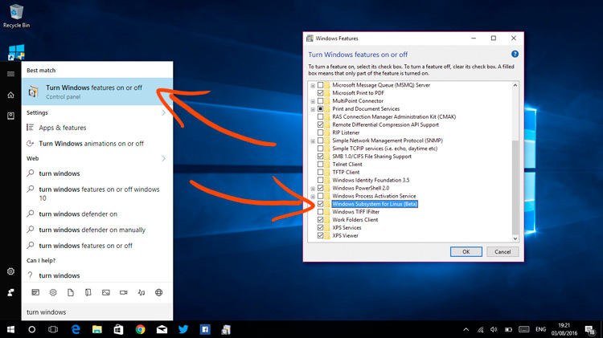
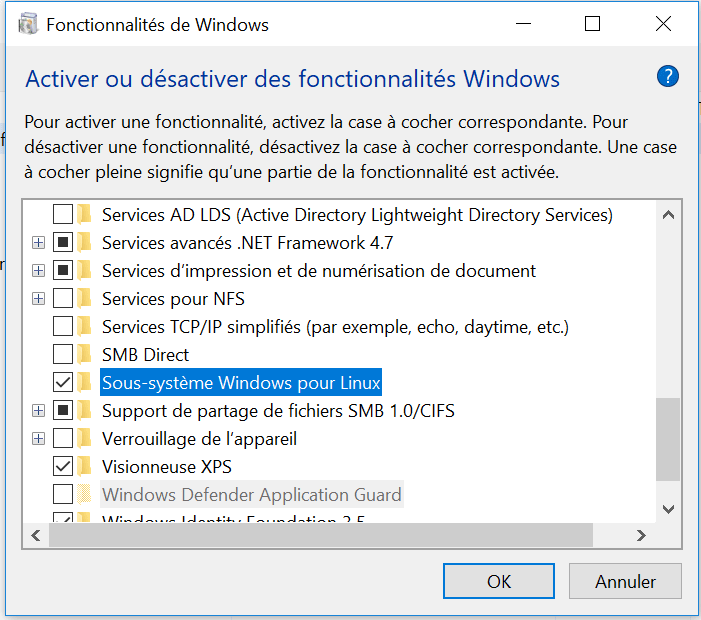
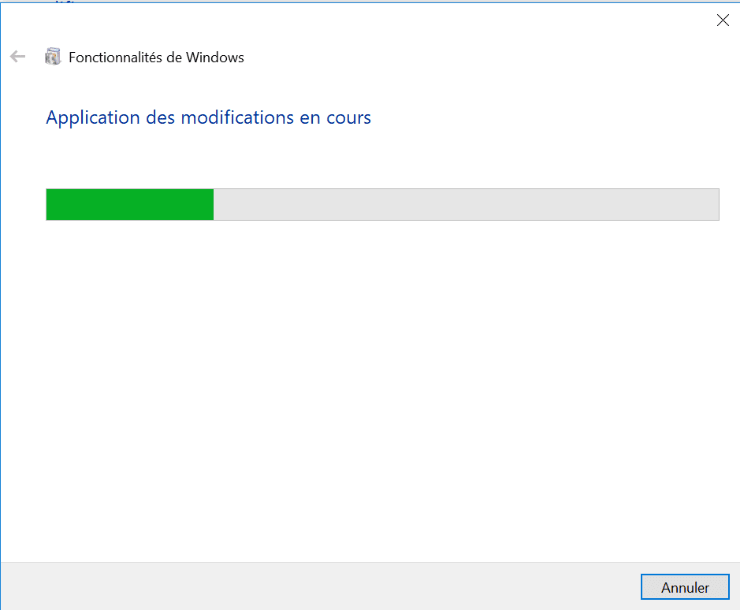
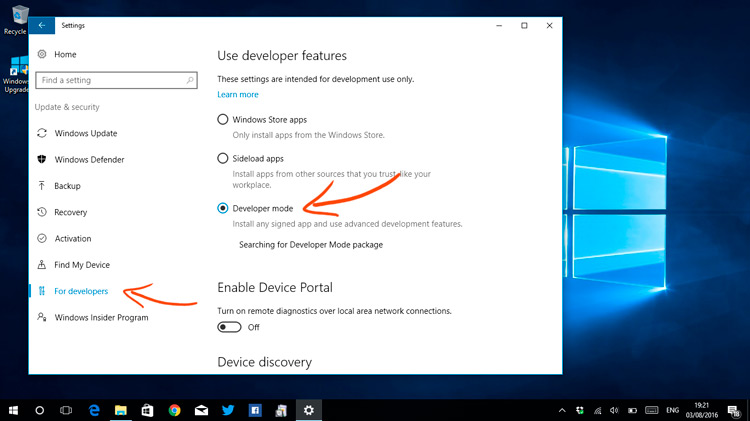

# Enable Windows Subsystem for Linux

```
Type in the research bar: Turn Windows features
```



Or for Windows french version 
```
Type in the research bar: Activer fonctionalités Windows
```





```
-  Reboot
-  Install ubuntu  version 22 or later  , from Microsoft/Windows store and then run the ubuntu application
```


```{caution}
If you are not able to see theses feature, you need to enable developer mode . To do this on Windows 
```

```
-  Go to Settings > Update & Security > For Developers > Developer Mode.
-  Search directly in the search bar of windows “Developer mode”

```



