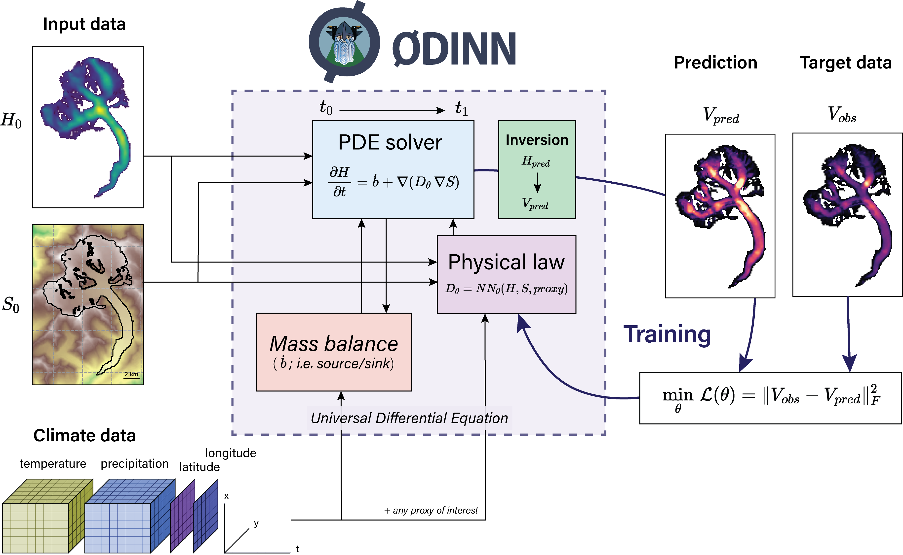

# ODINN

ODINN is a project and open-source large-scale glacier model developing new hybrid methods to explore new laws describing glacier physics. Through differentiable programming techniques, we are developing hybrid models combining differential equations describing ice flow with machine learning models to learn and parametrize subparts of equations. This can enable the discovery of parametrizations of glacier processes, such as glacier ice rheology, basal sliding or various surface mass balance processes, which can help reconcile our current mechanistic knowledge of glacier physics with new observations.

For more details about the model, please check [our GitHub page](https://github.com/ODINN-SciML/ODINN.jl).

## Overview

`ODINN.jl` uses neural networks and differential equations in order to combine mechanistic models describing glacier physical processes (e.g. ice creep, basal sliding, surface mass balance) with machine learning. Neural networks are used to learn parts of the equations, which then can be interpreted in a mathematical form (e.g. using SINDy) in order to update the original equation from the process. ODINN uses the Open Global Glacier Model ([OGGM](oggm.org/), Maussion et al., 2019) as a basic framework to retrieve all the topographical and climate data for the initial state of the simulations. This is done calling Python from Julia using PyCall. Then, all the simulations and processing are performed in Julia, benefitting from its high performance and the SciML ecosystem. 

> **Overview of `ODINN.jl`’s workflow to perform functional inversions of glacier physical processes using Universal Differential Equations**. The parameters ($θ$) of a function determining a given physical process ($D_θ$), expressed by a neural network $NN_θ$, are optimized in order to minimize a loss function. In this example, the physical to be inferred law was constrained only by climate data, but any other proxies of interest can be used to design it. The climate data, and therefore the glacier mass balance, are downscaled (i.e. it depends on $S$), with $S$ being updated by the solver, thus dynamically updating the state of the simulation for a given timestep.

##  People involved

|   Name       |  Position         |  Team            |  Building          | What                                                 |
| -------------|:-----------------:|:----------------:|:------------------:|:----------------------------------------------------:|
| [Jordi Bolibar](https://jordibolibar.org/)    | CNRS Research Scientist      | Cryodyn          |    MCP             | Direction and development |
| [Alban Gossard](https://albangossard.github.io/)   | Postdoc researcher      | Cryodyn          |    OSUG-B             | Method development and ice flow processes inversions |
| [Romain Millan](https://sites.google.com/view/romainmillan/home)  | CNRS Research Scientist      | Cryodyn          |    MCP            | Remote sensing observations |
| [Julien Le Sommer](https://lesommer.github.io/)  | CNRS Research Director      | MEOM          |    MCP            | Methodological strategy |

 

