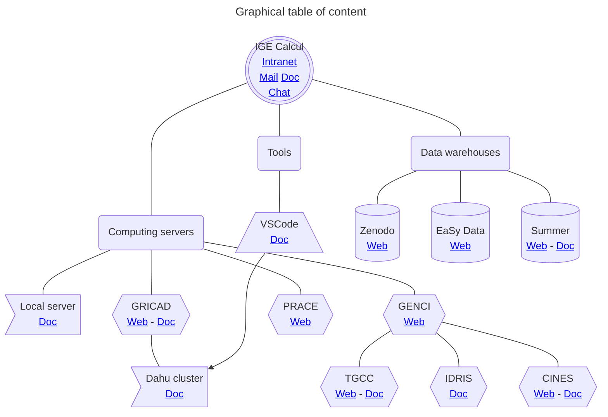

```mermaid
---
title: Graphical table of content
---
flowchart
    IGE(((<p>IGE Calcul</p><p><a href='https://ige-intranet.osug.fr/spip.php?rubrique157'>Intranet</a></p><p><a href='mailto:ige-calcul@univ-grenoble-alpes.fr'>Mail</a> <a href='https://github.com/ige-calcul/public-docs'>Doc</a></p><p><a href='https://github.com/ige-calcul/private-docs/blob/main/chat-server.md'>Chat</a></p>)))
    Computing(Computing servers)
    Local><p>Local server</p><a href='https://github.com/ige-calcul/public-docs/blob/main/clusters/Ige/ige-calcul1.md'>Doc</a>]
    GENCI{{<p>GENCI</p><p><a href='https://www.edari.fr/'>Web</a></p>}}
    IDRIS{{<p>IDRIS</p><p><a href='http://www.idris.fr/jean-zay/'>Doc</a></p>}}
    CINES{{<p>CINES</p><p><a href='https://www.cines.fr/calcul/adastra/'>Web</a> - <a href='https://dci.dci-gitlab.cines.fr/webextranet/index.html'>Doc</a></p>}}
    TGCC{{<p>TGCC</p><p><a href='https://www-hpc.cea.fr/fr/TGCC.html'>Web</a> - <a href='https://www-hpc.cea.fr/tgcc-public/en/html/tgcc-public.html'>Doc</a></p>}}
    GRICAD{{<p>GRICAD</p><p><a href='https://gricad.univ-grenoble-alpes.fr/'>Web</a> - <a href='https://gricad-doc.univ-grenoble-alpes.fr/'>Doc</a></p>}}
    Dahu><p>Dahu cluster</p><p><a href='https://github.com/ige-calcul/public-docs/blob/main/clusters/Gricad/dahu.md'>Doc</a></p>]
    PRACE{{<p>PRACE</p><p><a href='https://prace-ri.eu/'>Web</a></p>}}
    Tool(Tools)
    VSCode[/<p>VSCode</p><p><a href='https://github.com/ige-calcul/public-docs/blob/main/clusters/Tools/vscode.md'>Doc</a></p>\]
    Data(Data warehouses)
    Zenodo[(<p>Zenodo</p><p><a href='https://zenodo.org/'>Web</a></p>)]
    EasyData[(<p>EaSy Data</p><p><a href='https://www.easydata.earth/'>Web</a><p>)]
    Summer[(<p>Summer</p><p><a href='https://summer.univ-grenoble-alpes.fr/'>Web</a> - <a href='https://gricad-wiki.univ-grenoble-alpes.fr/wiki/doku.php?id=summer:doc_publique'>Doc</a></p>)]
    
    IGE --- Computing
    IGE --- Tool
    IGE --- Data
    Computing --- Local
    Computing --- GRICAD
    GRICAD --- Dahu
    Computing --- GENCI
    GENCI --- TGCC
    GENCI --- IDRIS
    GENCI --- CINES
    Computing --- PRACE
    Data --- Zenodo
    Data --- EasyData
    Data --- Summer
    Tool --- VSCode
    VSCode ---> Dahu
```
